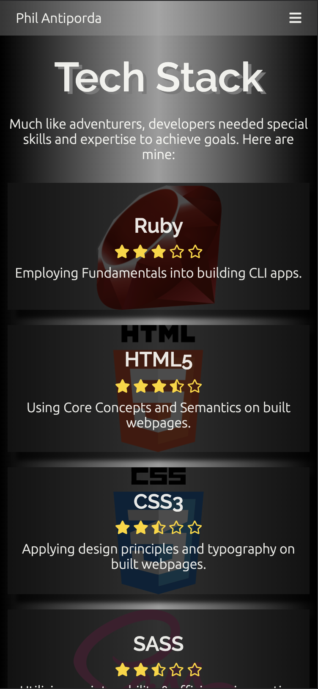
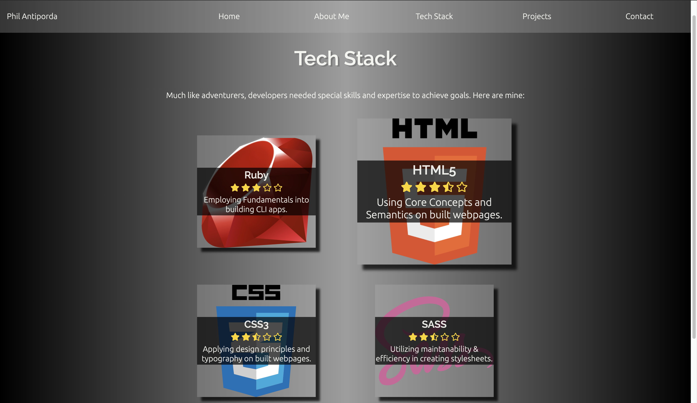

# My Portfolio :briefcase:

[URL](https://philantiporda.netlify.app/)
[Repository](https://github.com/philrussel21/my-portfolio)

## Purpose :bulb:

The purpose of this portfolio website is to briefly introduce myself through the language of the web, to showcase current skills and to share completed and WIP projects. A contact page has also been set up as well as an option to download my current resume.

## Functionality / Features :mag:

The main function of this project is to achieve its purpose. There are however additional feautures implemented for better UI/UX. This website was built and designed using the mobile-first approach.

### Home/Landing Page

The landing page for the URL provided. This page is designed with a video background. A poster has been put in place as a place holder background when the video is loading. An overlay has been put above the video for better readability and contrast of its content.

An animation of revolving text has also been designed for a more dynamic introduction and glow-like text shadows have been used to attract readers' attention. Social links have been put for interested parties.

The button "Learn More" provided would take the user to the next page, "About Me".

### Navigation

Navigation links for mobile(below 600px) and tablet(below 1024px) screen-size users are contained in a toggle triple-bars(hamburger) icon. When this icon is clicked, users can access the navigation links along with the social links.

Navigation links for desktop screen sizes are fixed on top of the page. Hover effects on each links have also been put in place. Social links would then be accomodated in the footer section.

This navigation setting is available across the whole project.

### About Me

This page consist of a brief introduction of myself and blog posts I have written. When blog cards are clicked, this would take the user to the relevant blog post.

On mobile-sized screen, blog title and intro are put inside the blog cards. An overlay color has been put in place for better readability and contrast of the content.

Tablet-sized screen seperates the blog content from its card. The blog title and intro are then put next to its card. This is also how desktop-sized screen is set up except a few changes. The cards are blurred and colour-filtered. Hovering on each card would reveal the card as well as give a floating animation.

### Tech Stack

This page lists my current tech stack. Disclaimer: The ratings provided were self-imposed and were only based on how I would rate my skills for the given language.

Mobile sized screen would display these tech stack like a list with content within each card. Tablet sized screen would put cards into a grid and desktop-sized screen would be the same with tablet except the hover features. Hovering on each tech stack would trigger the zoom and shine animation.

### Projects

This page displays all my finished and current projects. It hightlights one of my major works so far, the Raid my Kitchen! Terminal App then proceeds to list all my previous and current projects.

Mobile sized screen would list all these projects and their content would be contained inside. Tablet sized and Desktop sized screen would put all these other projects in a diamond-shaped mosaic. Hover floating animations were also put in place for these diamond shaped cards.

### Contact

This page would give the user an option to get in touch. Social links would be taken off the footer(desktop) or navigation(mobile & tablet) and considered to be one of the main contents of this page. Resume download and Contact form would also be provided for the user.

## Sitemap :key:

This project consist of 5 web pages. Please see below for the sitemap.

## Screenshots :camera_flash:

### Mobile

### Tablet

### Desktop

## Target Audience :clapper:

The target audience of this project are as follow:

-   Potential Employers
-   Mentors and Educators
-   Fellow peers
-   Meetup, events and conference organizers

## Tech Stack :toolbox:

The tech stack used for this project are as follows:

-   HTML5

    -   The standard markup language for all web pages. HTML5 has been used to set the structure of the project.

-   CSS3

    -   The adjective to HTML. CSS describes how HTML elements should be displayed.

-   SASS

    -   A CSS extension language that allows user to create style sheets faster. This language has been used to set up variables, apply nesting rules, and improve maintainability and readabilty by setting partials and mixins.

-   Javascript

    -   The verb to HTML. Gives HTML the ability to interact with its user. This language has been used to toggle navigation links on mobile and tablet view.

-   Git

    -   The version control system used for this project to track and maintain progress.

-   Github

    -   A Git repository hosting service used for this project.

-   Netlify
    -   Website used to deploy the static portfolio project. Github was linked to Netlify for continous update as the project progressed.
